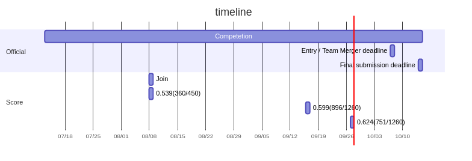

# [kaggle-brain-tumor](https://www.kaggle.com/c/rsna-miccai-brain-tumor-radiogenomic-classification)



## Overview

- 脳の悪性腫瘍の話
- MGMT promoter methylation があれば化学療法が効きやすい
- MGMT promoter methylation の判定には手術が必要で大変

  → 機械学習で MRI 画像から MGMT promoter methylation の有無を判定する

## Diagram

- Init

```
docker pull minlag/mermaid-cli
```

- Edit

```
vi assets/diagram.mmd
```

- Build

```
rm -f assets/diagram.png
docker run -it -v $(pwd)/assets:/data minlag/mermaid-cli -i /data/diagram.mmd -o /data/diagram.png
```

## Docs

| Title                                                                                                                                                     | Status  | Comment |
| --------------------------------------------------------------------------------------------------------------------------------------------------------- | ------- | ------- |
| [Getting started with Google Colab](https://www.kaggle.com/reubenschmidt/getting-started-in-rsna-miccai-with-google-colab/comments)                       | Not yet |         |
| [EDA for starter](https://www.kaggle.com/chumajin/brain-tumor-eda-for-starter-version)                                                                    | Not yet |         |
| [EDA+3D-Baseline – RSNA – Glioma Radiogenomics](https://www.kaggle.com/dschettler8845/eda-3d-baseline-rsna-glioma-radiogenomics)                          | Not yet |         |
| [Brain Tumor Radiogenomic Classification - EDA](https://www.kaggle.com/tanlikesmath/brain-tumor-radiogenomic-classification-eda?scriptVersionId=68158398) | Not yet |         |

## Diary

### 2021/08/08

- Started
- 概要読んでローカルにダウンロードしようとしたけどデータセット大きすぎる & 画像データなのでローカルで捌ききれないと判断
  - Google Colab でやる
