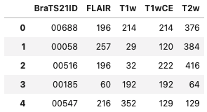
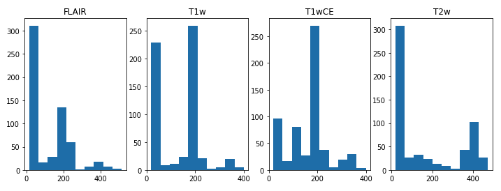
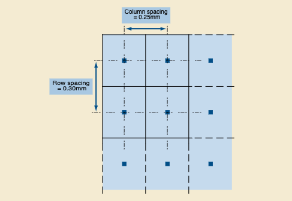

# [kaggle-brain-tumor](https://www.kaggle.com/c/rsna-miccai-brain-tumor-radiogenomic-classification)


## Overview

- 脳の悪性腫瘍の話
- MGMT promoter methylation があれば化学療法が効きやすい
- MGMT promoter methylation の判定には手術が必要で大変

  → 機械学習で MRI 画像から MGMT promoter methylation の有無を判定する

## Diagram

- Init

  ```
  docker pull minlag/mermaid-cli
  ```

- Edit

  ```
  vi assets/diagram.mmd
  ```

- Build

  ```
  rm -f assets/diagram.png
  docker run -it -v $(pwd)/assets:/data minlag/mermaid-cli -i /data/diagram.mmd -o /data/diagram.png
  ```

## Docs

| Title                                                                                                                                                    | Read       | Comment                                                              |
| -------------------------------------------------------------------------------------------------------------------------------------------------------- | ---------- | -------------------------------------------------------------------- |
| [Getting started with Google Colab](https://www.kaggle.com/reubenschmidt/getting-started-in-rsna-miccai-with-google-colab/comments)                      | 2021/08/08 | Colab で分析するチュートリアル、データサイズ上限により無料版では不可 |
| [EDA for starter](https://www.kaggle.com/chumajin/brain-tumor-eda-for-starter-version)                                                                   | 2021/08/09 | 画像の表示方法と `SliceLocation` について参考になった                |
| [Create 3D NPZ & TFRecords](https://www.kaggle.com/dschettler8845/create-3d-npz-tfrecords-rsna-radiogenomics)                                            | 2021/08/15 | DICOM 画像を圧縮した 3 次元のバイナリデータで扱う方法                |
| [ゼロから作る Deep Learning](https://www.oreilly.co.jp/books/9784873117584/)                                                                             | 2021/08/29 | Deep Learning の基礎と CNN の触り部分を理解した                      |
| [10 分で学ぶ NumPy 速習チュートリアル](https://deepage.net/features/numpy-numpy.html)                                                                    | 2021/09/04 | NumPy についておさらい                                               |
| [🧠🧬 EDA+3D-Baseline – RSNA – Glioma Radiogenomics](https://www.kaggle.com/dschettler8845/eda-3d-baseline-rsna-glioma-radiogenomics/notebook#modelling) | 2021/09/05 | データセットの作り方、`tf.keras` での学習                            |
| [Brain Tumor - EDA](https://www.kaggle.com/tanlikesmath/brain-tumor-radiogenomic-classification-eda?scriptVersionId=68158398)                            | 2021/09/05 | ↑ のノートブックの方が色々と詳しい。特になし                         |
| [Brain Tumor🧠 - EDA with Animations and Modeling](https://www.kaggle.com/ihelon/brain-tumor-eda-with-animations-and-modeling/data)                      | Not yet    |                                                                      |
| [Brain Tumor very basice inference](https://www.kaggle.com/lucamtb/brain-tumor-very-basice-inference)                                                    | Not yet    |                                                                      |
| [Efficientnet3D with one MRI type](https://www.kaggle.com/rluethy/efficientnet3d-with-one-mri-type)                                                      | Not yet    |                                                                      |
| [RSNA-MICCAI competition](https://www.kaggle.com/d223chen/rsna-miccai-competition)                                                                       | Not yet    |                                                                      |
| [[RF] Brain Tumor (FLAIR)](https://www.kaggle.com/hiroshisakiyama/rf-brain-tumor-flair)                                                                  | Not yet    |                                                                      |

## Diary

### 2021/08/08

- 概要読んでローカルにダウンロードしようとしたけどデータセット大きすぎる & 画像データなのでローカルで捌ききれないと判断
  - Google Colab で試したが、無料版のディスク容量ではデータセットを保存できない
  - Kaggle Notebook で
- 提出するファイルは以下（`submission.csv`）

  | BraTS21ID | MGMT_value |
  | --------- | ---------- |
  | 1         | 0          |
  | 2         | 1          |
  | 3         | 0          |
  | ...       | ...        |

  - `BraTS21ID`: 患者 ID
  - `MGMT_value`
    - `0`: MGMT プロモーターがメチル化されていない
    - `1`: MGMT プロモーターがメチル化されている

### 2021/08/09

- [2021/08/09 Brain Tumor - Count # of images](https://www.kaggle.com/mstkmyhr/2021-08-09-brain-tumor-count-of-images)

  - 患者 id ごとに 4 種類の MRI 画像が含まれている
  - MRI 画像の数は患者ごとにばらばら

  

  - 各 MRI 画像のファイル数の分布。

  

- [EDA for starter](https://www.kaggle.com/chumajin/brain-tumor-eda-for-starter-version) を読んだ

  - DICOM: MRI 含む医療用画像の保存形式
  - [pydicom](https://pydicom.github.io/pydicom/stable/old/getting_started.html): DICOM 形式のファイルを扱う Python パッケージ
  - 画像の表示方法がわかった（[2021/08/09 Brain Tumor - See MRI Images](https://www.kaggle.com/mstkmyhr/2021-08-09-brain-tumor-see-mri-images)で試した）
  - ファイル番号 != 時系列 な場合がある。`.dcm` ファイルの `SliceLocation` でソートすると時系列に並ぶ
    （MRI では断面図を上から撮影していく。`SliceLocation` でソートすると断面図を上から下に並べることができる）

- [2021/08/09 Brain Tumor - See MRI Images](https://www.kaggle.com/mstkmyhr/2021-08-09-brain-tumor-see-mri-images)

  - メチル化患者の FLAIR で右上が光る傾向がある？と思ったが、
    False(id = 803) でも右上が光っているのでそうでもない

- [2021/08/09 Brain Tumor - Attributes](https://www.kaggle.com/mstkmyhr/2021-08-09-brain-tumor-attributes)

  - 断面図を上から下の順に並べるには、たしかに `SliceLocation` で良さそう（`ImagePositionPatient` の y 軸でも同じ）
    ```
      AccessionNumber:00000
      ...
      ImageOrientationPatient:[1, -0, 0, -0, -0, -1]
    - ImagePositionPatient:[-125.094, 30.9865, 127.74]
    ?                                    ^
    + ImagePositionPatient:[-125.094, 30.3865, 127.74]
    ?                                    ^
      ImageType:['DERIVED', 'SECONDARY']
      ...
    - InStackPositionNumber:52
    ?                        ^
    + InStackPositionNumber:53
    ?                        ^
    - InstanceNumber:100
    ?                  ^
    + InstanceNumber:101
    ?                  ^
      ...
    - SOPInstanceUID:1.2.826.0.1.3680043.8.498.10904131910506455574025613086762249469
    + SOPInstanceUID:1.2.826.0.1.3680043.8.498.39056959140773619321268443511349211124
      ...
    - SliceLocation:-30.9865036
    ?                   ^     ^
    + SliceLocation:-30.38650131
    ?                   ^    + ^
      ...
    - WindowCenter:1172
    ?                ^^
    + WindowCenter:1148
    ?                ^^
    - WindowWidth:2344
    ?              ^^^
    + WindowWidth:2297
    ?              ^^^
    ```

### 2021/08/10

- [Create 3D NPZ & TFRecords – RSNA – Radiogenomics](https://www.kaggle.com/dschettler8845/create-3d-npz-tfrecords-rsna-radiogenomics)
  - [2021/08/10 Brain Tumor - Code Kata | Kaggle](https://www.kaggle.com/mstkmyhr/2021-08-10-brain-tumor-code-kata/edit) で写経する
  - `2 SETUP` まで完了、`3 HELPER FUNCTIONS` から

### 2021/08/11

- [Create 3D NPZ & TFRecords – RSNA – Radiogenomics](https://www.kaggle.com/dschettler8845/create-3d-npz-tfrecords-rsna-radiogenomics)
  - [2021/08/10 Brain Tumor - Code Kata | Kaggle](https://www.kaggle.com/mstkmyhr/2021-08-10-brain-tumor-code-kata/edit) で写経する
  - `3 HELPER FUNCTIONS` の途中まで

### 2021/08/14

- [Create 3D NPZ & TFRecords – RSNA – Radiogenomics](https://www.kaggle.com/dschettler8845/create-3d-npz-tfrecords-rsna-radiogenomics)

  - `apply_voi_lut` ってなに？

    - [LUT](http://ismini.tvlogic.tv/jp/technology/lutindex.html): あらかじめ用意したテーブルを使った色変換
    - [医療におけるデジタル画像と通信（DICOM）](https://www.jira-net.or.jp/dicom/file/standard/P03_11_j_BODY&Annex_A&B_20130409A.pdf)
      > VOI LUT IE は，モダリティ画素値のプリント，表示，などのために意味がある画素値への変換を記述する属性を定義する。

    -> 画像変換のためにピクセル変換するメソッドっぽい。

  - `get_numpy_arr`

    ```python
    # DICOM 画像 1 枚が ref_dicom.Rows x ref_dicom.Columns で構成され、画像が len(dicom_paths) 枚ある
    original_img_dims = (int(ref_dicom.Rows), int(ref_dicom.Columns), len(dicom_paths))
    ```

    ```python
    # DICOM 画像 1 枚が、ref_dicom.PixelSpacing[0] * ref_dicom.PixelSpacing[1] 行列のバイナリデータとして格納され、
    # ref_dicom.SliceThickness 枚の DICOM 画像が 1 患者の MRI イメージになっている
    px_spacing = (float(ref_dicom.PixelSpacing[0]), float(ref_dicom.PixelSpacing[1]), float(ref_dicom.SliceThickness))
    ```

    

### 2021/08/15

- [Create 3D NPZ & TFRecords – RSNA – Radiogenomics](https://www.kaggle.com/dschettler8845/create-3d-npz-tfrecords-rsna-radiogenomics)

  - `get_numpy_arr`

    - [scipy.ndimage.zoom — SciPy v1.7.1 Manual](https://docs.scipy.org/doc/scipy/reference/generated/scipy.ndimage.zoom.html)
      - 解像度を変更するメソッド
    - `(x, y)` 行列のバイナリデータとして保存されている MRI 画像を `RESIZE_TO` 行列に変換するメソッド(後の Deep Learning 用に画像を圧縮している？)

      画像を圧縮して表示するサンプルコード

      ```python
      dicom_paths = get_list_of_dcm_paths("../input/rsna-miccai-brain-tumor-radiogenomic-classification/train/00000/FLAIR")

      # NOTE: dicom_paths[0] = ../input/rsna-miccai-brain-tumor-radiogenomic-classification/train/00000/FLAIR/Image-1.dcm
      ref_dicom = pydicom.read_file(dicom_paths[0])

      # Load dimensions based on the number of rows, columns, and slices (along the Z axis)
      # Example: (512, 512, 400)
      original_img_dims = (int(ref_dicom.Rows), int(ref_dicom.Columns), len(dicom_paths))

      # Load spacing values (in mm)
      # Example: (0.5, 0.5, 1.2)
      px_spacing = (float(ref_dicom.PixelSpacing[0]), float(ref_dicom.PixelSpacing[1]), float(ref_dicom.SliceThickness))

      # The array is sized based on dicom information gathered above
      np_arr_list = []

      # loop through all the DICOM files
      for i, dcm_file in tqdm(enumerate(dicom_paths), total=len(dicom_paths)):

          dcm_slice = pydicom.read_file(dcm_file)
          slice_arr = dcm_slice.pixel_array
          if slice_arr.max() == 0:
              continue
          else:
              # NOTE: If each value is 0 < x < 1, then return 0. If it equals to 1, then return 1.
              slice_arr = ((slice_arr/np.max(slice_arr))*255).astype(np.uint8)

          # Add to the numpy slice list
          np_arr_list.append(slice_arr)

      # Convert array (z, y, x) to numpy array (x, y, z)
      np_array = np.stack(np_arr_list, axis=-1)

      # Example: (0.25, 0.25, 0.111...)
      magnification = (RESIZE_TO[0]/np_array.shape[0], RESIZE_TO[1]/np_array.shape[1], RESIZE_TO[-1]/np_array.shape[-1])

      zoomed = ndimage.zoom(np_array, magnification)
      fig = plt.figure()
      plt.imshow(zoomed[..., 16], vmin=0, vmax=255)
      plt.show()
      ```

- オフラインで Python パッケージをインストールする方法
  ```
  1. パッケージ名を [PyPI · The Python Package Index](https://pypi.org/) で検索
  2. `.whl` ファイルをダウンロード
  3. Jupyter Notebook に `.whl` をアップロード
  4. `!pip install "/path/to/file.whl"`
  ```

### 2021/08/18 - 2021/08/29

- [ゼロから作る Deep Learning](https://www.oreilly.co.jp/books/9784873117584/) を読んだ。
- [🧠🧬 EDA+3D-Baseline – RSNA – Glioma Radiogenomics | Kaggle](https://www.kaggle.com/dschettler8845/eda-3d-baseline-rsna-glioma-radiogenomics/notebook#modelling)
  - Keras のチュートリアルを試した。
  - モデルの作り方はなんとなくわかったけど、そもそも NumPy でのデータの扱いが苦手。

### 2021/09/04

- [Python での数値計算ライブラリ NumPy 徹底入門 - DeepAge](https://deepage.net/features/numpy/)
- [TensorFlow チュートリアル](https://www.tensorflow.org/tutorials?hl=ja)
  - 入門者向けに一通り目を通した
- [TensorFlow で使えるデータセット機能が強かった話 - Qiita](https://qiita.com/Suguru_Toyohara/items/820b0dad955ecd91c7f3)
  - [🧠🧬 EDA+3D-Baseline – RSNA – Glioma Radiogenomics | Kaggle](https://www.kaggle.com/dschettler8845/eda-3d-baseline-rsna-glioma-radiogenomics/notebook#modelling) で `tf.data.Dataset` を使っていて、よくわからなかったので勉強。

### 2021/09/05

- [🧠🧬 EDA+3D-Baseline – RSNA – Glioma Radiogenomics | Kaggle](https://www.kaggle.com/dschettler8845/eda-3d-baseline-rsna-glioma-radiogenomics/notebook#modelling) のデータセット作成部分を理解した。[210904_playground.ipynb](notebooks/210904_playground.ipynb) 参照。
- `model.summary()` は以下の通り

  ```
  ... EXAMPLE PREDICTION ...

  [[0.30933473]]


  ... MODEL SUMMARY ...

  Model: "3d_mpmri_cnn"
  _________________________________________________________________
  Layer (type)                 Output Shape              Param #
  =================================================================
  input_1 (InputLayer)         [(None, 128, 128, 32, 1)] 0
  _________________________________________________________________
  conv3d (Conv3D)              (None, 126, 126, 30, 64)  1792
  _________________________________________________________________
  max_pooling3d (MaxPooling3D) (None, 63, 63, 15, 64)    0
  _________________________________________________________________
  batch_normalization (BatchNo (None, 63, 63, 15, 64)    256
  _________________________________________________________________
  conv3d_1 (Conv3D)            (None, 61, 61, 13, 64)    110656
  _________________________________________________________________
  max_pooling3d_1 (MaxPooling3 (None, 30, 30, 6, 64)     0
  _________________________________________________________________
  batch_normalization_1 (Batch (None, 30, 30, 6, 64)     256
  _________________________________________________________________
  conv3d_2 (Conv3D)            (None, 28, 28, 4, 128)    221312
  _________________________________________________________________
  batch_normalization_2 (Batch (None, 28, 28, 4, 128)    512
  _________________________________________________________________
  conv3d_3 (Conv3D)            (None, 26, 26, 2, 256)    884992
  _________________________________________________________________
  batch_normalization_3 (Batch (None, 26, 26, 2, 256)    1024
  _________________________________________________________________
  dropout (Dropout)            (None, 26, 26, 2, 256)    0
  _________________________________________________________________
  global_average_pooling3d (Gl (None, 256)               0
  _________________________________________________________________
  dense (Dense)                (None, 128)               32896
  _________________________________________________________________
  dropout_1 (Dropout)          (None, 128)               0
  _________________________________________________________________
  dense_1 (Dense)              (None, 1)                 129
  =================================================================
  Total params: 1,253,825
  Trainable params: 1,252,801
  Non-trainable params: 1,024
  _________________________________________________________________
  ```

## 2021/09/06

- [2019 年最強の画像認識モデル EfficientNet 解説 - Qiita](https://qiita.com/omiita/items/83643f78baabfa210ab1)
  - Kaggle Notebook 見る限りよく使われてる。
  - パラメータ数が少なく（≒ 学習に必要なコンピューティングリソースが少なくて済む）、
    転移学習（≒ 別用途での学習済みモデルを他の学習に転用可能）にも向いている、
    モデルの「深さ」と「広さ」と「解像度(=入力画像の大きさ)」を調整するモデル。

## 2021/09/07

- Public Score 1.00 が数人いるが、test 用データが 87 人分しかないので `2 ** 87` を当てれば 1.00 になる。
  - shakedown するはずだから問題なし
- [白黒はっきりしない判定の評価のしかた 〜ROC 曲線と AUC〜](https://www.cresco.co.jp/blog/entry/15337/)
  - わかりやすい！
- [Brain Tumor🧠 - EDA with Animations and Modeling](https://www.kaggle.com/ihelon/brain-tumor-eda-with-animations-and-modeling/data)

  - `class Model` で `efficientnet-b0` を使用している
    -> b1 - b7 までモデルの大きさを変えれば精度が上がりそう
    モデルの大きさを上げれば上げるほど、学習に時間はかかりそう
    npz ファイルに保存して、別環境(Google Colab など)で学習させたモデルを適用するとか？

  - `class DataRetriever` で、画像を 1/10 に間引いている
    -> 使用する画像数を増やせば精度が上がりそう

  - `class Trainer.fit` のモデル保存ロジックがおかしい？
    Epoch ごとに `best-model-0.pth` を上書きしているような

- `torch.nn`、`torch.nn.function`、`torch.utils.data`、`efficientnet_pytorch` あたりの実装を調べる

  - [PyTorch チュートリアル（日本語翻訳版）](https://yutaroogawa.github.io/pytorch_tutorials_jp/)

    - [テンソル（Tensors）](https://colab.research.google.com/github/YutaroOgawa/pytorch_tutorials_jp/blob/main/notebook/0_Learn%20the%20Basics/0_1_tensors_tutorial_js.ipynb)

      > CPU 上のテンソルと NumPy arrays は同じメモリを共有しており、相互変換が容易

      NumPy としてデータ加工したい場合は、CPU 上で処理してからテンソルに変換し、
      GPU に乗せるのが良い？

## 2021/09/08

- [PyTorch チュートリアル（日本語翻訳版）](https://yutaroogawa.github.io/pytorch_tutorials_jp/)
  - [データセットとデータローダー（Datasets & DataLoaders）](https://colab.research.google.com/github/YutaroOgawa/pytorch_tutorials_jp/blob/main/notebook/0_Learn%20the%20Basics/0_2_data_tutorial_jp.ipynb)
    `__init__`、`__len__`、`__getitem__` を実装した Dataset を作り、DataLoader でバッチ処理を行う。

## 2021/09/09

- [PyTorch チュートリアル（日本語翻訳版）](https://yutaroogawa.github.io/pytorch_tutorials_jp/)

  - [データ変換（Transforms）](https://colab.research.google.com/github/YutaroOgawa/pytorch_tutorials_jp/blob/main/notebook/0_Learn%20the%20Basics/0_3_transforms_tutorial_jp.ipynb?authuser=3#scrollTo=O4VboPaL6HsB)

  `torch.scatter_()` の挙動が理解しにくかった。

  - `dim`: データを入れ込む方向
  - `index`: `self` のどの位置に `src` の値を入れ込むか
  - `src`: 入れ込むデータ
  - [Understand torch.scatter*(). First, note that scatter*() is an… | by Yu Yang | Medium](https://yuyangyy.medium.com/understand-torch-scatter-b0fd6275331c) がわかりやすい。

  ```python
  import torch
  src = torch.arange(1, 6).reshape(1, 5)
  index = torch.tensor([[0, 1, 2, 1, 0]])
  print("# self")
  display(torch.zeros(3, 5))
  print("- "*20)
  print("# index")
  display(index)
  print("- "*20)
  print("# src")
  display(src)
  print("- "*20)
  print("# self.scatter_(0, index, src)")
  display(torch.zeros(3, 5, dtype=torch.int64).scatter_(0, index, src))
  # # self
  # tensor([[0., 0., 0., 0., 0.],
  #         [0., 0., 0., 0., 0.],
  #         [0., 0., 0., 0., 0.]])
  # - - - - - - - - - - - - - - - - - - - -
  # # index
  # tensor([[0, 1, 2, 1, 0]])
  # - - - - - - - - - - - - - - - - - - - -
  # # src
  # tensor([[1, 2, 3, 4, 5]])
  # - - - - - - - - - - - - - - - - - - - -
  # # self.scatter_(0, index, src)
  # tensor([[1, 0, 0, 0, 5],
  #         [0, 2, 0, 4, 0],
  #         [0, 0, 3, 0, 0]])
  ```

## 2021/09/10

- [PyTorch チュートリアル（日本語翻訳版）](https://yutaroogawa.github.io/pytorch_tutorials_jp/)
  - [モデル構築（Build Model）](https://colab.research.google.com/github/YutaroOgawa/pytorch_tutorials_jp/blob/main/notebook/0_Learn%20the%20Basics/0_4_buildmodel_tutorial_js.ipynb?authuser=3)
    - `nn.Module` を継承したクラスを作成することで、ニューラルネットワークモデルを定義できる

## 疑問

- 各層はどうやって決める？ある程度決まったパターンがある？  
  それともトライアンドエラーしかない？
  - EfficientNet や SENet のように、各研究機関が用途別にモデルを作成してる
